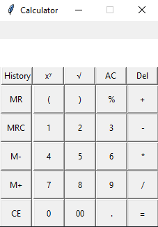
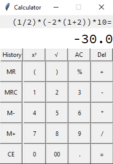
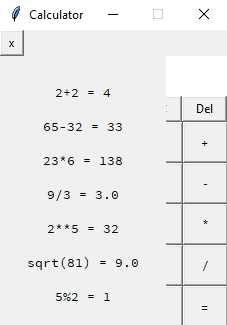

# Standard Calculator
Standard calculator made with Pyhton tkinter GUI module.

## Features
- Basic Arithemetic Operations
- Memory Functions 
- History

## Running
#### 1. Make sure to get python 3.9 or above 
This runtime is required to run the file

#### 2. Run the main.py file

## Preview

