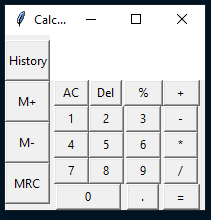
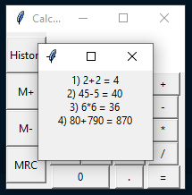

# GUI Calculator
Simple GUI calculator made with Pyhton tkinter module

## Running
#### Make sure to get python 3.9 or above 
This runtime is required to run the file

#### Run the main file

## Preview

